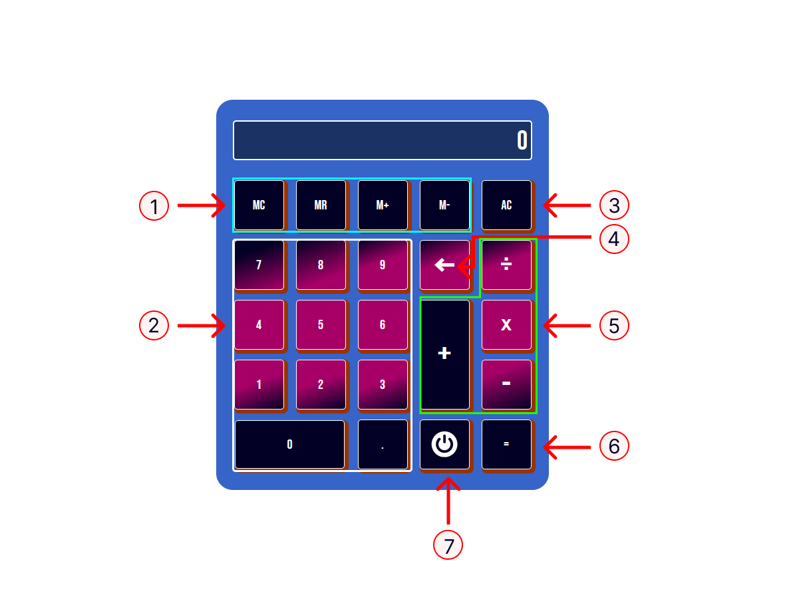

# Introduction

This is my take on the calculator project by [THE ODIN PROJECT](https://www.theodinproject.com/lessons/foundations-calculator).

Use cases have been provided below in checklist format.

Live: [Odin Calculator](https://joshdagat.github.io/Calculator/)
Repo: [Odin Repo](https://github.com/JoshDagat/Calculator)

# Technologies used
- CSS
- HTML
- Javascript

# Using the calculator

First go to the [calculator live page](https://joshdagat.github.io/Calculator/).

Desktop users can interact with the project using either the mouse or keyboard.
To know which keys are used see Buttons & Keys Section.

Mobile users can interact with the project by tapping on the buttons.

# Buttons & Keys

  

  1. 
Memory Buttons

   
      
Memory Clear (MC) - Resets internal memory to 0.

      
Memory Recall (MR) - Returns the value stored in memory.

      
Memory Add (M+) - Adds the current value on the display to the value in memory.

      
Memory Subtract (M-) - Subtracts the current value on the display from the value in memory.

  
2. 
Numerical Buttons - Used to input the desired value for operations

   
3. 
All Clear Button - Resets calculator to initial state. Loses current values stored in memory.

4. 
Delete Button - Removes the last character input from the calculator.

5. 
Operand Buttons

   
When clicked, all operand buttons check if there is a complete expression stored in memory. If so, that expression is first evaluated before changing the stored operation in memory.

   
Addition (+) - Sets  operation to addition.

    
Subtraction (-) - Sets operation to subtraction.

    
Multiplication (x) - Sets the operation to multiplication.

    
Division (&#247;) - Sets the operation to division. If the divisor used is '0', a snarky message is shown on screen.

6. 
Equals Button - Evaluates the expression stored in memory.

   
7. 
Power Button - Turns the Calculator on / off.

      
# Use cases:

- [x] Your calculator is going to contain functions for all of the basic math 
  operators you typically find on simple calculators, so start by creating 
  functions for the following items and testing them in your browser’s console.
      
      - [x] add
      - [x] subtract
      - [x] multiply
      - [x] divide
  
- [x] Create a new function 'operate' that takes an operator and 2 numbers and then calls one of the above functions on the numbers.

- [x] Create a basic HTML calculator with buttons for each digit, each of the above
      functions and an “Equals” key. Do not worry about wiring up the JS just yet.

- [x] There should also be a display for the calculator. Go ahead and fill it with 
      some dummy numbers so it looks correct.

- [x] Add a “clear” button.
    
- [x] Create the functions that populate the display when you click the number 
      buttons. You should be storing the ‘display value’ in a variable somewhere for use in the next step.
    
- [x] Make the calculator work! You’ll need to store the first number that is input 
     into the calculator when a user presses an operator, and also save which operation has been chosen and then operate() on them when the user presses the “=” key.

- [x] You should already have the code that can populate the display, so once 
      operate() has been called, update the display with the ‘solution’ to the operation. This is the hardest part of the project. You need to figure out how to store all the values and call the operate function with them. Don’t feel bad if it takes you a while to figure out the logic.
    

# Gotchas: watch out for and fix these bugs if they show up in your code:
        
  - [x] Users should be able to string together several operations and get the right 
       answer, with each pair of numbers being evaluated at a time. For example, 12 + 7 - 5 * 3 = should yield 42.
       
  - [x] Your calculator should not evaluate more than a single pair of numbers at a 
       time. Example: you press a number button (12), followed by an operator button (+), a second number button (7), and finally a second operator button (-). Your calculator should then do the following: first, evaluate the first pair of numbers (12 + 7), second, display the result of that calculation (19), and finally, use that result (19) as the first number in your new calculation, along with the next operator (-).
        
  - [x] You should round answers with long decimals so that they don’t overflow the 
       screen.
        
  - [x] Pressing = before entering all of the numbers or an operator could cause  
       problems!
        
  - [x] Pressing “clear” should wipe out any existing data.. make sure the user is 
       really starting fresh after pressing “clear”
        
  - [x] Display a snarky error message if the user tries to divide by 0… and don’t let 
       it crash your calculator!

# Extra Credit

  - [x] Users can get floating point numbers if they do the math required to get one, 
       but they can’t type them in yet. Add a . button and let users input decimals! Make sure you don’t let them type more than one though: 12.3.56.5. It is hard to do math on these numbers. (disable the decimal button if there’s already one in the display)
    
  - [x] Make it look nice! This is a great project to practice your CSS skills. At 
       least make the operations a different color from the keypad buttons.
    
  - [x] Add a “backspace” button, so the user can undo if they click the wrong number.
    
  - [x] Add keyboard support!
